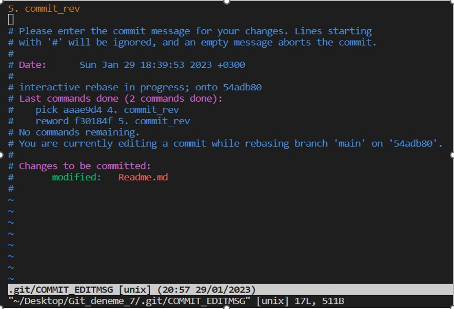

# GİT

**Untracked (İzlenmeyen)	:** GIT tarafından takip edilmeyen yani yeni oluşturulmuş dosyaları ifade eder.
**Unstaged (Hazırlanmamış)	:** Güncellenmiş fakat commitlenmek için hazırlanmamış dosyaları ifade eder.
**Staged (Hazırlanmış)		:** Commit’lenmeye hazır olan dosyaları ifade eder.
**Deleted (Silinmiş)		:** Projeden silinmiş ama GIT hesabından kaldırılmamış dosyaları ifade eder.

## Proje belirli bir aşamaya geldikten sonra GitHub'a dosya eklenmesinde aşağıdaki komutlar yol gösterici olarak kullanılabilir.

**```git init :```** Çalışılan proje dizininde boş bir git deposu oluşturulur.
**```git add . :```** Dizinde yer alan bütün dosyaların izlenmesi için kullanılır ```git add *```, ```git add -A```. Ya da [git add index.html] ile dosyalar tek tek izlenmeye alınır.
**```git commit -m ‘Açıklama Yazısı’ :```** Dizinde izlenen bütün dosyalar için commit işleminde kullanılır. Her commit’ten önce ```git add .``` komutu ile ilgili dosya izlemeye alınmalıdır.
**```git config --list :```** Git konfigürasyon ve ayarları liste halinde gösterilir.
**```git config --global user.name “Name Surname” :```** Globalde kullanıcı adı ayarlanır.
**```git config --global user.email “test@email.com” :```** Globalde kullanıcı mail adresi ayarlanır.
**```git rm --cached index.html :```** Staged ortamına eklenmiş dosyayı takipten çıkartmak için kullanılır.
**```git rm fileName :```** Dosyayı klasörden silmek için kullanılır.

***Buraya kadar Lokaldeki (PC’de) işlemler için geçerli komutlar yer almaktadır. Bundan sonra öncellikle GitHub’ta yeni repo oluşturulur. Sonrasında;***

**```git branch -M main :```** Main branch’ı oluşturulur ve geçiş yapılır.
**```git branch branchName :```** Yeni branch oluşturmak için kullanılır.
**```git branch -d branchName :```** Branch silmek için kullanılır.
**```git push origin -d branchName :```** VsCode üzerinden GitHub'da branch silmek için. VsCode üzerinde silinmez.
**```git push -u origin branchName :```** VsCode üzerinde branch oluşturup GitHub'a atmak için kullanılır.
**```git branch -a :```** Tüm uzak ve yerel branch'lari listelemek için kullanılır.
**```git checkout branchName :```** Başka branch’a geçmek için kullanılır.
**```git checkout -b branchName :```** Yeni branch oluşturup direkt geçmek için kullanılır.
**```git merge branchName :```** Main branch’a başka branch’daki değişiklikleri eklemek ya da birleştirmek için kullanılır.
**```git status :```** Üzerinde çalışılan projenin o anki durumunu verir. Yapılan değişiklikler (ekleme, çıkartma vs…) listelenir.
**```git clone https://github.com/sakardogukan/repoName.git :```** Github’ta yer alan bir projeyi PC’ye indirmek için kullanılır.
**```git remote add origin https://github.com/sakardogukan/repoName.git :```** Remote bağlantı sağlanır.
**```git remote :```** Bu komut ile “Origin” değerinin döndürüldüğü görülür.
**```git push -u origin main :```** Dosya ve commit’ler Repoya gönderilir.
**```git log :```** Projede tüm taahhüt edilen commi’tler ters kronolojik sıra ile (yeniden eskiye doğru) sıralanır. Çeşitli log parametreleri; ```git log --author="AuthorName"```, ```git log --name-status```, ```git log --name-status --pretty=oneline```
**```git diff 	:```** Projede değişiklik varsa listelenir.
**```git diff <commit_id_1>..<commit_id_2> :```** İki commit arasındaki fark listelenir.
**```git diff --staged :```** Çalışma dizini ve staged ortamı arasındaki fark listelenir.
**```git reset --hard HEAD~1 :```** HEAD~1 --> Son oluşturulan commit PC’den silinir. Github’tan silinmez.
**```git rebase -i HEAD~2 :```** Son oluşturulan 2 commit listelenir. Açılan SnapShot penceresinde [insert] tuşuna basılır. Açıklama yönergelerinde yer alan parametreleri [p, r, e, s, f, x, b, d, l, t, m] pick yazan yere yazılır. Örneğin ikinci satıra [r] eklenir [r f30184f 5.commit_rev]


[ESC] tuşuna basılır. [:wa!] ile kayıt yapılır ve [:qa!] ile çıkış yapıldıktan sonra aşağıdaki SnapShot ekranı açılır.



Bu ekranda önce [insert] tuşuna basılır, gerekli commit değişikliği ilk satırda yapılır. Sonra [ESC] tuşuna basılır. [:wa!] ile kayıt yapılır ve [:qa!] ile çıkış yapıldıktan sonra terminale geri dönüş yapılır. ```git log``` komutu ile teyit edilir. ```git push -f``` komutu ile GitHub hesabına gönderilir.

***Commit içerik değişikliği yapıldıktan sonra SHA kodu değişmektedir. Örneğin 10 adet commit yapılmış bir projede 4.commit’in içeriği değiştirilebilir, sıralaması değişmez fakat SHA kodu değişir.***

**git rebase -i SHA_Code^ :** Komutu ile değiştirilmesi istenilen commit’in SHA kodu ile direkt değişiklik yapılır. Açılan SnapShot ekranında önce [insert] tuşuna basılır, sonra [Pick] yazan yere [r] eklenir. Sonra [ESC] tuşuna basılır. [:wa!] ile kayıt yapılır ve [:qa!] ile çıkış yapıldıktan sonra ikinci bir SnapShot penceresi açılır. Bu ekranda önce [insert] tuşuna basılır, gerekli commit değişikliği ilk satırda yapılır. Sonra [ESC] tuşuna basılır. [:wa!] ile kayıt yapılır ve [:qa!] ile çıkış yapıldıktan sonra terminale geri dönüş yapılır. ```git log``` komutu ile teyit edilir. ```git push -f``` komutu ile GitHub hesabına gönderilir.