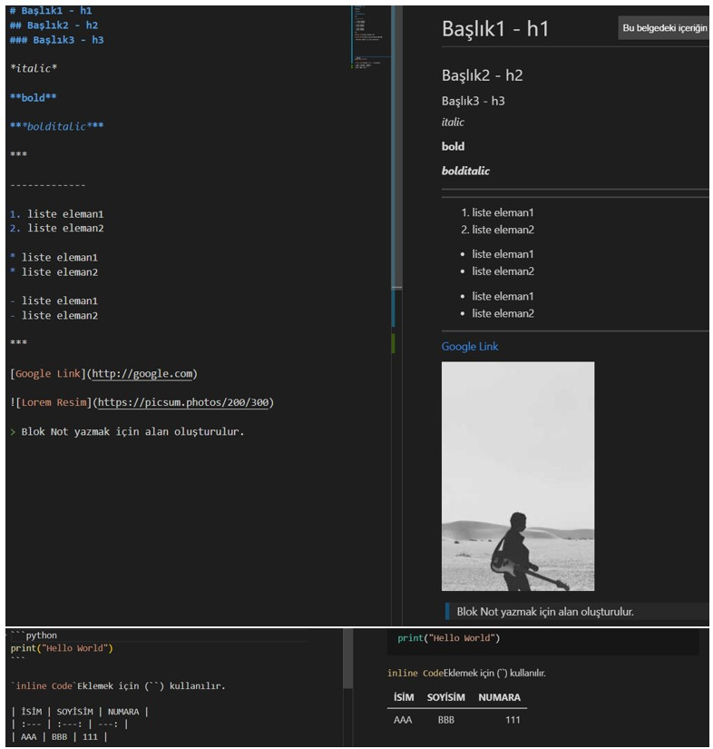

# Markdown

Markdown, John Gruber ve Aaron Swartz tarafından geliştirilen ve 2004 yılından bu yana kullanılan metinlerden HTML'e (text-to-HTML) dönüşüm için kullanılan hafif bir işaretleme dilidir. GitHub benzeri platformlarda kullanıcıların aşina olduğu Markdown formatı, yaygın kanının aksine sadece README dosyaları oluşturmak kullanılmaz. Temel amaç okunabilirliği ve kullanılabilirliği arttırmaktır. Basitliği ve sadeliği sayesinde forumlarda ileti yazmaktan, kitap yazmaya kadar pek çok yerde kullanılabilir. ```https://commonmark.org/help/```  adresinden söz dizimleri incelenebilir. ```Readme.md``` dosyasında ```.md``` markdown’u simgeler.

